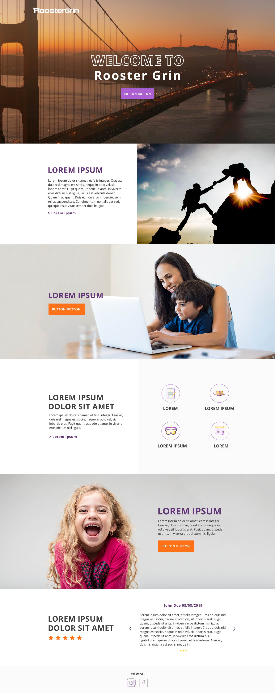

# Front-End-Dev-Test for Rooster Grin
This is a front-end interface build for the company Rooster Grin following the wireframe given.



## Set Up
To get a copy of this project on your machine, clone the repository. Then run,
```
npm install
npm start
```

## Technologies Used:
+ HTML
+ CSS
+ Javascript
+ Bootstrap
+ React.JS

## Reflection
I choose to use these technologies because they have what is needed to build this project. Specifically, I choose to use react for the layout to modulize the many repeating component in this page. Honestly, I think React may be a bit over kill for the project since it is a pretty static page which many of React's feature was not utilized. I used bootstrap to style the webpage as bootstrap has the built in grid system and carousel which are both needed. 

When I was building this project, I ran into a webpack issue which my css file could not locate the image file in the public folder. I tried many method to resolve but none of them work. I finally resolve to using inline styling for the background image instead of the css file. 

One thing I really enjoy from working on this project is that I constantly discover new things while I was building it. For instance, I have never realized that the webpack issue existed. Another thing I discover was that there is a build in padding in bootstrap column and you will need to use additional class to remove it. 

## Acknowledge
Most icon used in this project are from FontAwesome. 


